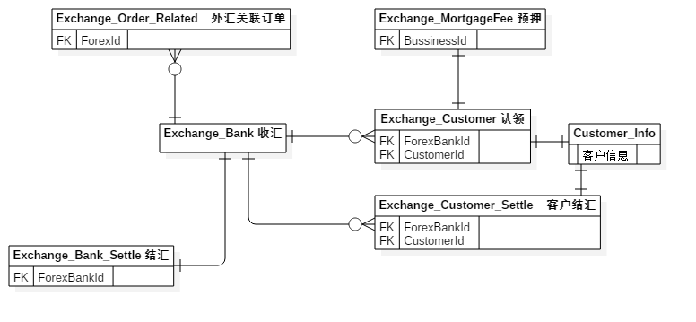

:sectnums:

:toc: left 
=  供应链平台功能整理

== 工作台 Desktop

== 客户管理 Customer

== 开票人管理 Manufacture

== 产品管理 Product

== 订单管理 Order

== 通关管理 Order

== 风控管理 Order

== 外汇管理 Exchange

=== 表之间的关系

=== 表结构

include::tables/exchange.adoc[]

=== 流程

国外转帐进入账户，自己进行转帐操作
通过对接银行进行新增或者自己进行新增。
（Exchange_Bank）
新增完成之后产生一笔外汇，
这笔外汇可以被认领

结汇，新增的外汇可以结汇（Exchange_Bank_Settle,Exchange_Customer_Settle）

== 退税管理 TaxRebate

== 资金管理 Settle

== 业务审批 Approval

== 通用数据 BasicData

== 系统安全 Security

== 子账户管理

== 数据报表

== 通关查询 （暂无）
== MINE ACCOUNT
.账号
|===
|account |pwd |url

| mj013 | www.3miky.net | http://www.pms.3miky.net[禅道]
| yehang  | 2018mj-yh | link:svn://120.79.32.147/sever/code[svn]
| scarlett8   | Woshictt5  |
|  013yh@3miky.net  | Yehang1205  | http://mail.3miky.net/[mail Addr]
|  admin | 12345678  | http://localhost:8080/login[System]
|root|2017mj@sz!|120.79.32.147
|  Administrator | miju2018!| 119.23.48.17
|  m | www.3miky.net| http://www.jsd.3miky.net/
|深圳市蜜桔科技有限公司 | lxq929011|
|===
==  名词解释
.名称解释
|===
|编号 |名称 |解释

|1|签约客户|
|1|营销客户|
|1|营销leads|
|1|开票人|
|1| 待解付资金信息 | 转帐中
|2| 解付成功| 转帐成功
|3|结汇| 把其他货币换成人民币
|4|外汇认领|
|5|收汇|
|6|付汇|
|===
